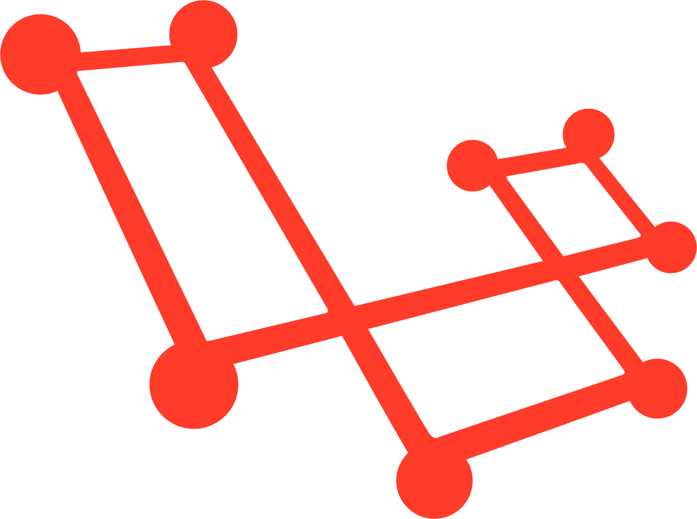

<p align="center">
  
</p>

# Laravel GraphQL

[](//packagist.org/packages/supliu/laravel-graphql) [](//packagist.org/packages/supliu/laravel-graphql) [](//packagist.org/packages/supliu/laravel-graphql) [](//packagist.org/packages/phpunit/phpunit)

The objective of this project is to facilitate the integration of the <a href="https://github.com/webonyx/graphql-php">webonyx/graphql-php</a>  with the Laravel Framework

## How to install

Use composer to install this package

```ssh
composer require supliu/laravel-graphql
```

Execute a publish with artisan command:

```
php artisan vendor:publish --provider="Supliu\LaravelGraphQL\ServiceProvider"
```

## How to use

You must create your <a href="https://graphql.org/learn/queries/">Query</a> and <a href="https://graphql.org/learn/queries/#mutations">Mutation</a> classes and register on `config/graphql.php` so that GraphQL can read.

```php
'queries' => [
    'detailHero' => \App\GraphQL\Queries\DetailHero::class
],

'mutations' => [
    'updateHero' => \App\GraphQL\Mutations\UpdateHero::class
]
```

### Query

Below is an example of a Query class that returns the data of a Star Wars hero:

```php
<?php

namespace App\GraphQL\Queries;

use GraphQL\Type\Definition\ObjectType;
use GraphQL\Type\Definition\Type;
use Supliu\LaravelGraphQL\Query;

class DetailHero extends Query
{
    /**
     * @return array
     */
    protected function args(): array
    {
        return [
            'id' => Type::nonNull(Type::int())
        ];
    }
    
    /**
     * @return Type
     */
    protected function typeResult(): Type
    {
        return new ObjectType([
            'name' => 'HeroQueryResult',
            'fields' => [
                'name' => Type::string()
            ]
        ]);
    }

    /**
     * @return mixed
     */
    protected function resolve($root, $args, $context, $info)
    {
        return Hero::find($args['id']);
    }
}
```

### Mutation

Below is an example of a Mutation class that returns if update worked:

```php
<?php

namespace App\GraphQL\Mutations;

use GraphQL\Type\Definition\ObjectType;
use GraphQL\Type\Definition\Type;
use Supliu\LaravelGraphQL\Mutation;

class UpdateHero extends Mutation
{
    protected function typeResult(): Type
    {
        return new ObjectType([
            'name' => 'UpdateHeroResult',
            'fields' => [
                'error' => Type::boolean(),
                'message' => Type::string()
            ]
        ]);
    }

    /**
     * @return array
     */
    protected function args(): array
    {
        return [
            'id' => Type::nonNull(Type::int())
            'name' => Type::nonNull(Type::string())
        ];
    }

    /**
     * @return mixed
     */
    protected function resolve($root, $args, $context, $info)
    {
        Hero::find($args['id'])->update([
          'name' => $args['name']
        ]);
    
        return [
            'error' => false,
            'message' => 'Updated!'
        ];
    }
}
```

## License

The Laravel GraphQL is open-sourced project licensed under the [MIT license](https://opensource.org/licenses/MIT).
